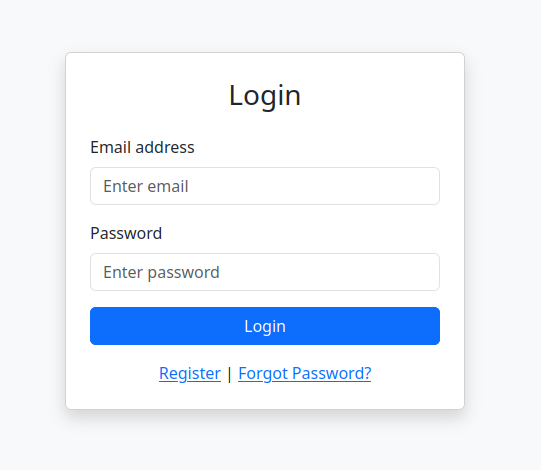
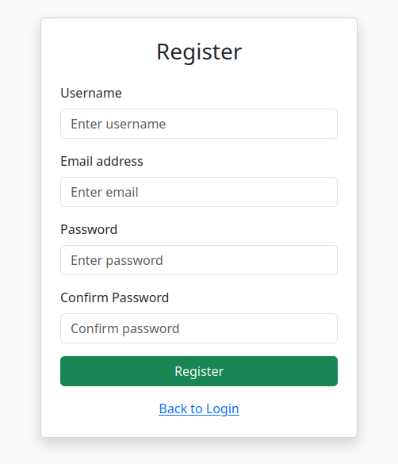
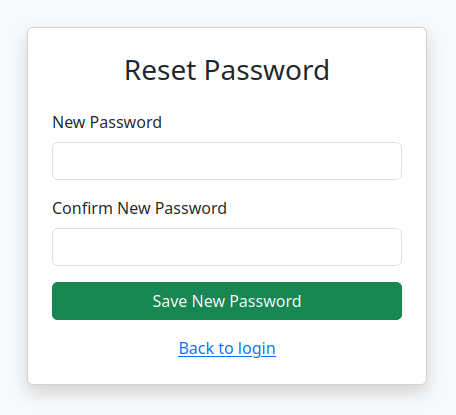

# Flask/MySQL : Login/Register Web App

Login, Register, Forgot Password with Python, Flask and MySQL

Files:
- `app.py`

Folders:
- static
- templates

## Running the app

cd flask_login

source .venv/bin/activate

export FLASK_APP=app.py

flask run

